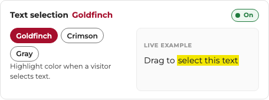

# FreeSlate User Manual — Tweakable Design Tokens

> **Auto-generated** by `docs-generator/Program.cs` — do not edit manually.
> Re-run `cd docs-generator && dotnet run` after each deployment to refresh screenshots.

## What This Guide Covers

The FreeSlate kit exposes **41 design tokens** — CSS custom properties in `build.css` section `TOKENS` —
that let you customize the look and feel of every Slate form page without touching any component code.
Think of them as a character creator: move any slider, you still can't leave the WSU brand.

Each setting below includes:
- **What it does** — the CSS property it controls
- **Screenshot** — captured live from the configurator
- **CSS token** — the custom property name to override in `build.css`
- **Default value** — what ships out of the box
- **Accessibility notes** — WCAG compliance and impact on assistive technology users
- **Design guidance** — when/why you'd change it
- **Reference links** — CSS spec and WCAG understanding docs

---

## Table of Contents

### Type
- [1. Body text size](#bodysize)
- [2. Reading line-height](#line)
- [3. Body text color](#bodyink)
- [4. Link text size](#linksize)
- [5. Link weight](#linkweight)
- [6. Link underline](#underline)
- [7. Underline offset](#underlineoffset)
- [8. Paragraph width](#measure)
- [9. H1 crimson bar](#h1bar)
- [10. Bar length](#h1barstyle)
- [11. Heading alignment](#headalign)
- [12. H1 weight](#h1weight)
- [13. Heading color](#headcolor)
- [14. H2 size](#h2size)
- [15. H3 size](#h3size)
- [16. Heading line-height](#headline)
- [17. Heading letter-spacing](#headtrack)
### Shape & density
- [18. Corner radius](#round)
- [19. Input border width](#inputborder)
- [20. Field fill](#inputbg)
- [21. Button size](#btnsize)
- [22. Button border](#btnborder)
- [23. Button weight](#btnweight)
- [24. Button text case](#btncase)
- [25. Field density](#density)
- [26. Label weight](#labelweight)
- [27. Label size](#labelsize)
- [28. Textarea height](#textareah)
- [29. Checkbox size](#choicesize)
### Brand cues
- [30. Focus ring width](#focus)
- [31. Focus ring color](#focuscolor)
- [32. Focus ring offset](#focusoffset)
- [33. Required-field edge](#edge)
- [34. Required star color](#star)
- [35. Required star size](#starsize)
- [36. Text selection](#selection)
- [37. Topbar hairline](#topbarrule)
### Page
- [38. Content width](#col)
- [39. Content padding](#pagepad)
- [40. Content paper](#paper)
- [41. Page backdrop](#wash)

---

## Type

<a id="bodysize"></a>
### 1. Body text size


| Property | Value |
|----------|-------|
| **CSS Token** | `--wsu-eit-body-size` |
| **Default** | `1rem (16px)` |
| **Control type** | range |
| **Group** | Type |

#### What It Does

Base reading size for all paragraph text. Controls the default font-size for body copy across the entire form.

#### Accessibility (a11y)

WCAG 1.4.4 Resize Text requires text to scale to 200% without loss of content. The kit uses rem units so browser zoom works natively. Setting this below 16px risks failing WCAG AA for users who haven't adjusted their browser defaults.

#### Design Guidance

Users with low vision rely on browser font-size settings. Using rem (relative to root) means this token respects those preferences. Never set body text below 15px — research shows 16px is the minimum comfortable reading size on screens.

#### References

- **CSS property:** [https://www.w3schools.com/cssref/pr_font_font-size.php](https://www.w3schools.com/cssref/pr_font_font-size.php)
- **WCAG Understanding:** [https://www.w3.org/WAI/WCAG21/Understanding/resize-text.html](https://www.w3.org/WAI/WCAG21/Understanding/resize-text.html)

---

<a id="line"></a>
### 2. Reading line-height


| Property | Value |
|----------|-------|
| **CSS Token** | `--wsu-eit-line` |
| **Default** | `1.55` |
| **Control type** | range |
| **Group** | Type |

#### What It Does

Vertical space between lines of paragraph text. Affects readability of multi-line content blocks.

#### Accessibility (a11y)

WCAG 1.4.12 Text Spacing requires that line-height can be set to at least 1.5x font size without loss of content. The kit's default of 1.55 already exceeds this. Reducing below 1.4 makes dense paragraphs harder to track for users with dyslexia or cognitive disabilities.

#### Design Guidance

Tight line-heights (below 1.3) cause lines to visually merge for users with tracking difficulties. The 1.5-1.6 range is the research-backed sweet spot for body copy. Headings can go tighter (1.1-1.2) because they're short.

#### References

- **CSS property:** [https://www.w3schools.com/cssref/pr_dim_line-height.php](https://www.w3schools.com/cssref/pr_dim_line-height.php)
- **WCAG Understanding:** [https://www.w3.org/WAI/WCAG21/Understanding/visual-presentation.html](https://www.w3.org/WAI/WCAG21/Understanding/visual-presentation.html)

---

<a id="bodyink"></a>
### 3. Body text color


| Property | Value |
|----------|-------|
| **CSS Token** | `--wsu-eit-body` |
| **Default** | `#262626` |
| **Control type** | choice |
| **Group** | Type |

#### What It Does

The ink color for all body copy. All offered choices pass WCAG AA contrast on white backgrounds.

#### Accessibility (a11y)

WCAG 1.4.3 Contrast (Minimum) requires 4.5:1 for normal text, 3:1 for large text. The default #262626 delivers ~13.5:1 against white — AAA level. Even the 'Soft gray' option (#3a3a3a) provides ~9:1, still AAA. Never use body text lighter than #595959 on white (fails AA).

#### Design Guidance

Pure black (#000000) on pure white (#ffffff) creates maximum contrast but can cause eye strain for extended reading ('halation' effect). The near-black #262626 softens this while still clearing AAA by a wide margin.

#### References

- **CSS property:** [https://www.w3schools.com/cssref/pr_text_color.php](https://www.w3schools.com/cssref/pr_text_color.php)
- **WCAG Understanding:** [https://www.w3.org/WAI/WCAG21/Understanding/contrast-minimum.html](https://www.w3.org/WAI/WCAG21/Understanding/contrast-minimum.html)

---

<a id="linksize"></a>
### 4. Link text size


| Property | Value |
|----------|-------|
| **CSS Token** | `--wsu-eit-link-size` |
| **Default** | `16px (1rem)` |
| **Control type** | range |
| **Group** | Type |

#### What It Does

Minimum rendered size for hyperlinks. Links never shrink below this floor, ensuring they remain tappable and readable.

#### Accessibility (a11y)

Larger link text improves both readability and target size. WCAG 2.5.5 (Target Size Enhanced, AAA) recommends 44x44px touch targets. While this controls text size not hit area, larger text naturally creates larger clickable regions.

#### Design Guidance

Links at 14px or smaller become difficult to tap on mobile devices. The 16px floor ensures links are always at least as large as body text, maintaining visual hierarchy and touch accessibility.

#### References

- **CSS property:** [https://www.w3schools.com/cssref/pr_font_font-size.php](https://www.w3schools.com/cssref/pr_font_font-size.php)
- **WCAG Understanding:** [https://www.w3.org/WAI/WCAG21/Understanding/target-size-enhanced.html](https://www.w3.org/WAI/WCAG21/Understanding/target-size-enhanced.html)

---

<a id="linkweight"></a>
### 5. Link weight


| Property | Value |
|----------|-------|
| **CSS Token** | `--wsu-eit-link-weight` |
| **Default** | `600 (Semibold)` |
| **Control type** | choice |
| **Group** | Type |

#### What It Does

Font weight of hyperlinks. Semibold (600) is the shipped default — makes links visually distinct from surrounding body text without needing color alone.

#### Accessibility (a11y)

WCAG 1.4.1 Use of Color states links cannot be distinguished from surrounding text by color alone. The kit uses underline + weight to provide multiple visual cues. If you set weight to Regular (400), the underline becomes the sole non-color differentiator — ensure it remains visible.

#### Design Guidance

Semibold links create a subtle but scannable visual rhythm in paragraphs. Bold (700) draws more attention but can feel heavy in dense copy. Regular (400) relies entirely on the underline — fine if underlines are always present.

#### References

- **CSS property:** [https://www.w3schools.com/cssref/pr_font_weight.php](https://www.w3schools.com/cssref/pr_font_weight.php)
- **WCAG Understanding:** [https://www.w3.org/WAI/WCAG21/Understanding/use-of-color.html](https://www.w3.org/WAI/WCAG21/Understanding/use-of-color.html)

---

<a id="underline"></a>
### 6. Link underline


| Property | Value |
|----------|-------|
| **CSS Token** | `--wsu-eit-underline` |
| **Default** | `1px` |
| **Control type** | range |
| **Group** | Type |

#### What It Does

Thickness of the underline beneath hyperlinks. This is the primary non-color indicator that text is a link.

#### Accessibility (a11y)

WCAG 1.4.1 Use of Color: links must be identifiable without relying on color perception alone. The underline is the universal link affordance. Setting to 0 removes it — acceptable ONLY if link weight provides a 3:1 luminance contrast ratio against surrounding text (per WCAG technique G183).

#### Design Guidance

Removing underlines entirely is a common a11y mistake. The 1px default is subtle but clear. 2-3px creates a bolder 'highlighter' effect that some brands prefer. Thicker underlines can interfere with descenders (g, p, y) — use the offset setting to compensate.

#### References

- **CSS property:** [https://www.w3schools.com/cssref/css3_pr_text-decoration-thickness.php](https://www.w3schools.com/cssref/css3_pr_text-decoration-thickness.php)
- **WCAG Understanding:** [https://www.w3.org/WAI/WCAG21/Understanding/use-of-color.html](https://www.w3.org/WAI/WCAG21/Understanding/use-of-color.html)

---

<a id="underlineoffset"></a>
### 7. Underline offset


| Property | Value |
|----------|-------|
| **CSS Token** | `--wsu-eit-underline-offset` |
| **Default** | `0.18em` |
| **Control type** | range |
| **Group** | Type |

#### What It Does

Gap between link text baseline and the underline. Prevents the underline from clipping through descending letters like g, p, y.

#### Accessibility (a11y)

While not directly a WCAG requirement, proper offset prevents the underline from making descenders unreadable. A too-large offset (>0.3em) can make the underline look disconnected from its text, confusing users about what's clickable.

#### Design Guidance

The em unit means offset scales with text size automatically. 0.18em works well for Montserrat; fonts with longer descenders may need more.

#### References

- **CSS property:** [https://www.w3schools.com/cssref/css3_pr_text-underline-offset.php](https://www.w3schools.com/cssref/css3_pr_text-underline-offset.php)
- **WCAG Understanding:** [https://www.w3.org/WAI/WCAG21/Understanding/text-spacing.html](https://www.w3.org/WAI/WCAG21/Understanding/text-spacing.html)

---

<a id="measure"></a>
### 8. Paragraph width


| Property | Value |
|----------|-------|
| **CSS Token** | `--wsu-eit-measure` |
| **Default** | `75ch` |
| **Control type** | range |
| **Group** | Type |

#### What It Does

Maximum line length (measure) for body text. Controls how wide paragraphs grow before wrapping. Expressed in 'ch' units (width of the '0' character).

#### Accessibility (a11y)

WCAG 1.4.8 Visual Presentation (AAA) recommends no more than 80 characters per line. The default 75ch keeps text within this guideline. 'Off' removes the cap entirely — text runs full-width, often exceeding 120+ characters on wide screens, severely degrading readability.

#### Design Guidance

Research (Baymard Institute, NNGroup) consistently shows 50-75 characters per line is optimal for reading comprehension. Shorter lines (45-55ch) suit narrow columns; wider (80-90ch) suits data-heavy content. The 'ch' unit adapts to font changes automatically.

#### References

- **CSS property:** [https://www.w3schools.com/cssref/pr_dim_max-width.php](https://www.w3schools.com/cssref/pr_dim_max-width.php)
- **WCAG Understanding:** [https://www.w3.org/WAI/WCAG21/Understanding/visual-presentation.html](https://www.w3.org/WAI/WCAG21/Understanding/visual-presentation.html)

---

<a id="h1bar"></a>
### 9. H1 crimson bar


| Property | Value |
|----------|-------|
| **CSS Token** | `--wsu-eit-h1-bar` |
| **Default** | `4px` |
| **Control type** | range |
| **Group** | Type |

#### What It Does

Height of the signature crimson rule that appears beneath page titles (H1 headings). A distinctive WSU brand cue.

#### Accessibility (a11y)

The bar is decorative — it doesn't convey information. Screen readers skip it entirely (it's rendered via CSS ::after with no content). Setting to 0 removes the brand cue but has no accessibility impact. The bar's crimson color meets non-text contrast requirements (3:1+ against white).

#### Design Guidance

This mimics the heading treatment on wsu.edu and admission.wsu.edu. It signals 'you're on a WSU page' to sighted users. The thickness range (0-12px) stays proportional to heading text.

#### References

- **CSS property:** [https://www.w3schools.com/cssref/pr_border-bottom.php](https://www.w3schools.com/cssref/pr_border-bottom.php)
- **WCAG Understanding:** [https://www.w3.org/WAI/WCAG21/Understanding/info-and-relationships.html](https://www.w3.org/WAI/WCAG21/Understanding/info-and-relationships.html)

---

<a id="h1barstyle"></a>
### 10. Bar length


| Property | Value |
|----------|-------|
| **CSS Token** | `--wsu-eit-h1-bar-width` |
| **Default** | `100% (Full underline)` |
| **Control type** | choice |
| **Group** | Type |

#### What It Does

Whether the H1 crimson bar spans the full heading width or renders as a short 'tick' mark. The centered tick is the WSU callout heading style.

#### Accessibility (a11y)

No direct a11y impact — purely decorative. The short tick (3.5rem) draws the eye to centered headings; the full underline creates clear visual separation between the heading and content below.

#### Design Guidance

Choose 'Full underline' for left-aligned headings (standard forms). Choose 'Short tick' for centered headings (landing pages, event pages) — it matches WSU's callout heading treatment.

#### References

- **CSS property:** [https://www.w3schools.com/cssref/pr_dim_width.php](https://www.w3schools.com/cssref/pr_dim_width.php)
- **WCAG Understanding:** [https://www.w3.org/WAI/WCAG21/Understanding/meaningful-sequence.html](https://www.w3.org/WAI/WCAG21/Understanding/meaningful-sequence.html)

---

<a id="headalign"></a>
### 11. Heading alignment


| Property | Value |
|----------|-------|
| **CSS Token** | `--wsu-eit-head-align + --wsu-eit-h1-bar-mx` |
| **Default** | `left` |
| **Control type** | choice |
| **Group** | Type |

#### What It Does

Text alignment for page headings. 'Centered' also centers the crimson bar, creating the WSU 'callout heading' look.

#### Accessibility (a11y)

WCAG 1.4.8 recommends left-aligned text for LTR languages. Centered text is harder to track across multiple lines. For headings (typically 1-2 lines) centering is acceptable, but for multi-line headings, left alignment improves scanability for users with cognitive or visual disabilities.

#### Design Guidance

Left alignment suits form pages (users scan down a left edge). Centered alignment suits landing/event pages where the heading is a focal point.

#### References

- **CSS property:** [https://www.w3schools.com/cssref/pr_text_text-align.php](https://www.w3schools.com/cssref/pr_text_text-align.php)
- **WCAG Understanding:** [https://www.w3.org/WAI/WCAG21/Understanding/visual-presentation.html](https://www.w3.org/WAI/WCAG21/Understanding/visual-presentation.html)

---

<a id="h1weight"></a>
### 12. H1 weight


| Property | Value |
|----------|-------|
| **CSS Token** | `--wsu-eit-h1-weight` |
| **Default** | `800 (Extrabold)` |
| **Control type** | choice |
| **Group** | Type |

#### What It Does

Font weight of the page title (H1). Controls how bold/heavy the main heading appears.

#### Accessibility (a11y)

Heavier weights make headings more visually distinct from body text, reinforcing the document hierarchy for sighted users. Screen readers announce heading level regardless of visual weight. If weight is too light (400), sighted users may not perceive the heading as a heading, creating a disconnect between visual and semantic structure.

#### Design Guidance

Extrabold (800) is the WSU brand standard for display text. Bold (700) is slightly subtler. Black (900) is the maximum available in Montserrat.

#### References

- **CSS property:** [https://www.w3schools.com/cssref/pr_font_weight.php](https://www.w3schools.com/cssref/pr_font_weight.php)
- **WCAG Understanding:** [https://www.w3.org/WAI/WCAG21/Understanding/info-and-relationships.html](https://www.w3.org/WAI/WCAG21/Understanding/info-and-relationships.html)

---

<a id="headcolor"></a>
### 13. Heading color


| Property | Value |
|----------|-------|
| **CSS Token** | `--wsu-eit-head-color` |
| **Default** | `var(--wsu-eit-body) (Black)` |
| **Control type** | choice |
| **Group** | Type |

#### What It Does

Color of H2/H3 section headings. Choose between near-black (matching body) or crimson (brand accent).

#### Accessibility (a11y)

Both options pass WCAG AA for large text (headings qualify as large text at >=18.7px bold). Crimson #A60F2D provides ~7.4:1 on white (AAA). The black option (#262626) provides ~13.5:1 (AAA). Both are safe choices.

#### Design Guidance

Crimson headings create a stronger brand presence but can feel heavy in forms with many sections. Black headings feel neutral and professional. Consider crimson for marketing pages (events, landing) and black for functional forms (applications, registrations).

#### References

- **CSS property:** [https://www.w3schools.com/cssref/pr_text_color.php](https://www.w3schools.com/cssref/pr_text_color.php)
- **WCAG Understanding:** [https://www.w3.org/WAI/WCAG21/Understanding/contrast-minimum.html](https://www.w3.org/WAI/WCAG21/Understanding/contrast-minimum.html)

---

<a id="h2size"></a>
### 14. H2 size


| Property | Value |
|----------|-------|
| **CSS Token** | `--wsu-eit-h2-size` |
| **Default** | `1.45rem (~23px)` |
| **Control type** | range |
| **Group** | Type |

#### What It Does

Font size of major section headings (H2). These divide the form into logical chunks.

#### Accessibility (a11y)

Heading sizes must maintain a clear hierarchy: H1 > H2 > H3 > body. If H2 is too close to body size, the document structure becomes unclear to sighted users. The rem unit ensures headings scale with browser zoom (WCAG 1.4.4).

#### Design Guidance

The range (1.2-1.85rem) keeps H2 visually distinct from both H1 above and H3 below. A modular scale (each level ~1.2x the next) creates natural rhythm.

#### References

- **CSS property:** [https://www.w3schools.com/cssref/pr_font_font-size.php](https://www.w3schools.com/cssref/pr_font_font-size.php)
- **WCAG Understanding:** [https://www.w3.org/WAI/WCAG21/Understanding/resize-text.html](https://www.w3.org/WAI/WCAG21/Understanding/resize-text.html)

---

<a id="h3size"></a>
### 15. H3 size


| Property | Value |
|----------|-------|
| **CSS Token** | `--wsu-eit-h3-size` |
| **Default** | `1.15rem (~18px)` |
| **Control type** | range |
| **Group** | Type |

#### What It Does

Font size of sub-headings (H3). Auto-capped to stay below H2 — a sub-heading never visually outsizes its parent.

#### Accessibility (a11y)

WCAG 1.3.1 requires that heading hierarchy is programmatically determinable. Visual sizing should match semantic level — if H3 looks bigger than H2, sighted users get a false hierarchy cue. The auto-cap enforces this.

#### Design Guidance

The dynamic maximum (always < H2) prevents configuration mistakes. If you shrink H2, H3 automatically shrinks to stay subordinate.

#### References

- **CSS property:** [https://www.w3schools.com/cssref/pr_font_font-size.php](https://www.w3schools.com/cssref/pr_font_font-size.php)
- **WCAG Understanding:** [https://www.w3.org/WAI/WCAG21/Understanding/info-and-relationships.html](https://www.w3.org/WAI/WCAG21/Understanding/info-and-relationships.html)

---

<a id="headline"></a>
### 16. Heading line-height


| Property | Value |
|----------|-------|
| **CSS Token** | `--wsu-eit-head-line` |
| **Default** | `1.18` |
| **Control type** | range |
| **Group** | Type |

#### What It Does

Line spacing within multi-line headings. Tighter than body text because headings are short and benefit from compact vertical rhythm.

#### Accessibility (a11y)

WCAG 1.4.12 allows line-height override to 1.5x on all text. The kit's heading line-height is intentionally tight (display use) but will expand if a user applies a 1.5x override via browser extension — the layout doesn't break.

#### Design Guidance

Headings at 1.05 feel tight and modern (magazine style). At 1.4 they feel spacious and formal. The default 1.18 balances brand with readability.

#### References

- **CSS property:** [https://www.w3schools.com/cssref/pr_dim_line-height.php](https://www.w3schools.com/cssref/pr_dim_line-height.php)
- **WCAG Understanding:** [https://www.w3.org/WAI/WCAG21/Understanding/text-spacing.html](https://www.w3.org/WAI/WCAG21/Understanding/text-spacing.html)

---

<a id="headtrack"></a>
### 17. Heading letter-spacing


| Property | Value |
|----------|-------|
| **CSS Token** | `--wsu-eit-head-track` |
| **Default** | `0em (normal)` |
| **Control type** | range |
| **Group** | Type |

#### What It Does

Tracking (letter-spacing) on headings. Negative values tighten letters; positive values spread them apart.

#### Accessibility (a11y)

WCAG 1.4.12 Text Spacing requires letter-spacing can be set to at least 0.12em without breaking layout. The kit respects user overrides. Negative tracking (tightening) can make text harder to read for users with dyslexia — use sparingly and only on large display headings.

#### Design Guidance

Tight tracking (-0.02em) creates a modern, dense feel. Positive tracking (+0.04em) reads more formal/editorial. Extreme values in either direction hurt legibility.

#### References

- **CSS property:** [https://www.w3schools.com/cssref/pr_text_letter-spacing.php](https://www.w3schools.com/cssref/pr_text_letter-spacing.php)
- **WCAG Understanding:** [https://www.w3.org/WAI/WCAG21/Understanding/text-spacing.html](https://www.w3.org/WAI/WCAG21/Understanding/text-spacing.html)

---

## Shape & density

<a id="round"></a>
### 18. Corner radius


| Property | Value |
|----------|-------|
| **CSS Token** | `--wsu-eit-round` |
| **Default** | `6px` |
| **Control type** | range |
| **Group** | Shape & density |

#### What It Does

Border radius on inputs, buttons, callout boxes, and other interactive elements. Controls the overall geometric feel — sharp vs. soft.

#### Accessibility (a11y)

No direct WCAG requirement for corner radius. However, extremely rounded inputs (>16px) can reduce the perceived clickable area, as users may not realize the corners are part of the input. The 0-24px range keeps all controls clearly identifiable as form elements.

#### Design Guidance

0px = sharp, institutional, 'government form' feel. 6px = subtle softness (the WSU default). 12-24px = friendly, modern, 'startup' feel. Match the rest of your institution's digital properties for consistency.

#### References

- **CSS property:** [https://www.w3schools.com/cssref/css3_pr_border-radius.php](https://www.w3schools.com/cssref/css3_pr_border-radius.php)
- **WCAG Understanding:** [https://www.w3.org/WAI/WCAG21/Understanding/non-text-contrast.html](https://www.w3.org/WAI/WCAG21/Understanding/non-text-contrast.html)

---

<a id="inputborder"></a>
### 19. Input border width


| Property | Value |
|----------|-------|
| **CSS Token** | `--wsu-eit-input-border` |
| **Default** | `1px` |
| **Control type** | range |
| **Group** | Shape & density |

#### What It Does

Thickness of the border around text fields, selects, and textareas. The sole visual boundary of form controls.

#### Accessibility (a11y)

WCAG 1.4.11 Non-text Contrast requires UI components to have at least 3:1 contrast against adjacent colors. The kit's border color (#767676) provides 4.5:1 against white. Setting border to 0 removes the visual boundary entirely — the field becomes invisible to users who rely on border cues, violating 1.4.11.

#### Design Guidance

1px is standard and clean. 2px adds weight and visibility (helpful for users with low vision). 3px is bold/decorative. Never set to 0 unless the field has a background fill that provides the required contrast.

#### References

- **CSS property:** [https://www.w3schools.com/cssref/pr_border-width.php](https://www.w3schools.com/cssref/pr_border-width.php)
- **WCAG Understanding:** [https://www.w3.org/WAI/WCAG21/Understanding/non-text-contrast.html](https://www.w3.org/WAI/WCAG21/Understanding/non-text-contrast.html)

---

<a id="inputbg"></a>
### 20. Field fill


| Property | Value |
|----------|-------|
| **CSS Token** | `--wsu-eit-input-bg` |
| **Default** | `var(--wsu-eit-paper) (White)` |
| **Control type** | choice |
| **Group** | Shape & density |

#### What It Does

Background color inside text fields. 'Mist gray' adds a subtle tint that distinguishes inputs from the page background.

#### Accessibility (a11y)

A filled background can serve as a secondary boundary cue, helping identify fields even if borders are thin. However, the fill color must maintain sufficient contrast with text typed into the field. Both options (white, mist gray) provide excellent contrast with dark text.

#### Design Guidance

White fields on a white page rely entirely on borders for identification. Mist-gray fields are self-evident even without a border — useful if you want a borderless modern look while maintaining a11y.

#### References

- **CSS property:** [https://www.w3schools.com/cssref/pr_background-color.php](https://www.w3schools.com/cssref/pr_background-color.php)
- **WCAG Understanding:** [https://www.w3.org/WAI/WCAG21/Understanding/non-text-contrast.html](https://www.w3.org/WAI/WCAG21/Understanding/non-text-contrast.html)

---

<a id="btnsize"></a>
### 21. Button size


| Property | Value |
|----------|-------|
| **CSS Token** | `--wsu-eit-btn-pad-y / --wsu-eit-btn-pad-x` |
| **Default** | `Standard (.75rem / 2rem)` |
| **Control type** | choice |
| **Group** | Shape & density |

#### What It Does

Padding inside primary action buttons (Submit, CTA links). Controls how much space surrounds the button label text.

#### Accessibility (a11y)

WCAG 2.5.5 Target Size (Enhanced, AAA) requires 44x44px minimum touch targets. All three sizes meet this for typical button text. 'Compact' may fall below 44px height with short labels on high-DPI screens — test on actual devices.

#### Design Guidance

Compact suits dense interfaces with many actions. Standard is the universal safe choice. Large suits hero CTAs where you want one dominant action (like 'Start application').

#### References

- **CSS property:** [https://www.w3schools.com/cssref/pr_padding.php](https://www.w3schools.com/cssref/pr_padding.php)
- **WCAG Understanding:** [https://www.w3.org/WAI/WCAG21/Understanding/target-size-enhanced.html](https://www.w3.org/WAI/WCAG21/Understanding/target-size-enhanced.html)

---

<a id="btnborder"></a>
### 22. Button border


| Property | Value |
|----------|-------|
| **CSS Token** | `--wsu-eit-btn-border` |
| **Default** | `2px` |
| **Control type** | range |
| **Group** | Shape & density |

#### What It Does

The border ringing buttons. Uses the same crimson as the button fill, creating a solid-looking button even at small sizes.

#### Accessibility (a11y)

The border adds to the button's visual footprint and provides a crisp edge that helps it stand out from surrounding content. At 0px the button relies solely on its background fill — still accessible as long as the fill color contrasts with the page (crimson on white = 7.4:1).

#### Design Guidance

2px is the WSU default — provides a definitive edge. 0px creates a 'flat' modern button. 4px creates a thick frame effect.

#### References

- **CSS property:** [https://www.w3schools.com/cssref/pr_border-width.php](https://www.w3schools.com/cssref/pr_border-width.php)
- **WCAG Understanding:** [https://www.w3.org/WAI/WCAG21/Understanding/non-text-contrast.html](https://www.w3.org/WAI/WCAG21/Understanding/non-text-contrast.html)

---

<a id="btnweight"></a>
### 23. Button weight


| Property | Value |
|----------|-------|
| **CSS Token** | `--wsu-eit-btn-weight` |
| **Default** | `600 (Semibold)` |
| **Control type** | choice |
| **Group** | Shape & density |

#### What It Does

Font weight of button label text. Affects how prominent and readable the button's call-to-action text appears.

#### Accessibility (a11y)

White text on crimson buttons meets WCAG AA for large text at all offered weights. Heavier weights improve legibility at small sizes and are easier to read for users with low vision.

#### Design Guidance

Medium (500) feels light and modern. Semibold (600) is the shipped standard — clear without being heavy. Bold (700) adds extra emphasis.

#### References

- **CSS property:** [https://www.w3schools.com/cssref/pr_font_weight.php](https://www.w3schools.com/cssref/pr_font_weight.php)
- **WCAG Understanding:** [https://www.w3.org/WAI/WCAG21/Understanding/contrast-minimum.html](https://www.w3.org/WAI/WCAG21/Understanding/contrast-minimum.html)

---

<a id="btncase"></a>
### 24. Button text case


| Property | Value |
|----------|-------|
| **CSS Token** | `--wsu-eit-btn-transform + --wsu-eit-btn-track` |
| **Default** | `none (Normal case)` |
| **Control type** | choice |
| **Group** | Shape & density |

#### What It Does

Whether button labels render in normal sentence case or are transformed to UPPERCASE. Uppercase adds letter-spacing automatically for legibility.

#### Accessibility (a11y)

UPPERCASE text is harder to read because word shapes become uniform rectangles — readers lose the ascender/descender cues that speed recognition. For short button labels (2-4 words) this isn't a significant barrier, but avoid uppercase on buttons with long labels. Screen readers announce the text normally regardless of CSS text-transform.

#### Design Guidance

Normal case is friendlier and more readable. UPPERCASE reads as more formal/institutional. The kit automatically adds letter-spacing (0.06em) when uppercase is active to compensate for the density.

#### References

- **CSS property:** [https://www.w3schools.com/cssref/pr_text_text-transform.php](https://www.w3schools.com/cssref/pr_text_text-transform.php)
- **WCAG Understanding:** [https://www.w3.org/WAI/WCAG21/Understanding/reading-level.html](https://www.w3.org/WAI/WCAG21/Understanding/reading-level.html)

---

<a id="density"></a>
### 25. Field density


| Property | Value |
|----------|-------|
| **CSS Token** | `--wsu-eit-field-pad-y / --wsu-eit-field-pad-x / --wsu-eit-q-gap` |
| **Default** | `Standard (.7rem / .85rem / 1.5rem)` |
| **Control type** | choice |
| **Group** | Shape & density |

#### What It Does

A combined knob that adjusts input padding AND question-to-question spacing together. Prevents mismatched padding/gap combinations.

#### Accessibility (a11y)

Denser forms pack more questions per screen but reduce the whitespace that helps users parse field boundaries. WCAG 2.5.5 still applies — ensure inputs remain >=44px tall at 'Compact' density. The 'Roomy' option adds generous spacing that benefits users with motor disabilities (larger targets) and cognitive disabilities (clearer field separation).

#### Design Guidance

Compact suits long applications (many questions). Standard is the safe default. Roomy suits short forms or audiences that benefit from extra space (e.g., older adults, users with motor impairments).

#### References

- **CSS property:** [https://www.w3schools.com/cssref/pr_padding.php](https://www.w3schools.com/cssref/pr_padding.php)
- **WCAG Understanding:** [https://www.w3.org/WAI/WCAG21/Understanding/target-size-enhanced.html](https://www.w3.org/WAI/WCAG21/Understanding/target-size-enhanced.html)

---

<a id="labelweight"></a>
### 26. Label weight


| Property | Value |
|----------|-------|
| **CSS Token** | `--wsu-eit-label-weight` |
| **Default** | `600 (Semibold)` |
| **Control type** | choice |
| **Group** | Shape & density |

#### What It Does

Font weight of question labels (the text above each input). Controls visual prominence of field names.

#### Accessibility (a11y)

WCAG 3.3.2 Labels or Instructions requires visible labels for all form inputs. Heavier label weights make labels more visually distinct from help text and placeholder text, reducing the chance users skip over them.

#### Design Guidance

Regular (400) creates a quiet, minimal aesthetic but can make labels blend into surrounding text. Semibold (600) clearly distinguishes labels. Bold (700) makes labels dominant in the visual hierarchy.

#### References

- **CSS property:** [https://www.w3schools.com/cssref/pr_font_weight.php](https://www.w3schools.com/cssref/pr_font_weight.php)
- **WCAG Understanding:** [https://www.w3.org/WAI/WCAG21/Understanding/labels-or-instructions.html](https://www.w3.org/WAI/WCAG21/Understanding/labels-or-instructions.html)

---

<a id="labelsize"></a>
### 27. Label size


| Property | Value |
|----------|-------|
| **CSS Token** | `--wsu-eit-label-size` |
| **Default** | `0.95rem (~15px)` |
| **Control type** | range |
| **Group** | Shape & density |

#### What It Does

Font size of question labels. Adjust relative to body text — labels should be prominent but not overwhelming.

#### Accessibility (a11y)

Labels must be large enough to read comfortably. Below 0.85rem (~13.6px) labels become hard to read for users with mild vision impairment. The rem unit ensures labels scale with browser zoom.

#### Design Guidance

Labels slightly smaller than body text (0.95rem) create hierarchy without shouting. At 1.0rem they match body text exactly. At 1.1rem they dominate — useful for forms where field identification is critical.

#### References

- **CSS property:** [https://www.w3schools.com/cssref/pr_font_font-size.php](https://www.w3schools.com/cssref/pr_font_font-size.php)
- **WCAG Understanding:** [https://www.w3.org/WAI/WCAG21/Understanding/resize-text.html](https://www.w3.org/WAI/WCAG21/Understanding/resize-text.html)

---

<a id="textareah"></a>
### 28. Textarea height


| Property | Value |
|----------|-------|
| **CSS Token** | `--wsu-eit-textarea-h` |
| **Default** | `7rem` |
| **Control type** | range |
| **Group** | Shape & density |

#### What It Does

Minimum height of multi-line text boxes (textareas). Sets the visual expectation of how much text is expected.

#### Accessibility (a11y)

A generous default height signals 'write more than a sentence.' Too-small textareas (2.5rem = single line height) discourage responses and confuse the expectation. Users can always resize, but the initial height sets the psychological frame.

#### Design Guidance

Match height to expected response length: 2.5-4rem for short answers (1-2 sentences), 7rem for paragraphs (personal statements, essays), 10-12rem for long-form responses.

#### References

- **CSS property:** [https://www.w3schools.com/tags/att_textarea_rows.asp](https://www.w3schools.com/tags/att_textarea_rows.asp)
- **WCAG Understanding:** [https://www.w3.org/WAI/WCAG21/Understanding/identify-input-purpose.html](https://www.w3.org/WAI/WCAG21/Understanding/identify-input-purpose.html)

---

<a id="choicesize"></a>
### 29. Checkbox size


| Property | Value |
|----------|-------|
| **CSS Token** | `--wsu-eit-choice-size` |
| **Default** | `1.15rem (~18px)` |
| **Control type** | range |
| **Group** | Shape & density |

#### What It Does

Size of radio buttons and checkboxes. Larger targets are easier to tap on touch devices.

#### Accessibility (a11y)

WCAG 2.5.5 requires 44x44px targets. While the visual checkbox may be 18px, the clickable label area around it typically meets the 44px requirement. Larger checkboxes (1.3-1.5rem) improve precision for users with motor impairments and are easier to see for users with low vision.

#### Design Guidance

Browser-default checkboxes are typically 13-16px. The kit enlarges them for touch accessibility. The range (1.0-1.5rem) keeps them proportional to their labels.

#### References

- **CSS property:** [https://www.w3schools.com/cssref/pr_dim_width.php](https://www.w3schools.com/cssref/pr_dim_width.php)
- **WCAG Understanding:** [https://www.w3.org/WAI/WCAG21/Understanding/target-size-enhanced.html](https://www.w3.org/WAI/WCAG21/Understanding/target-size-enhanced.html)

---

## Brand cues

<a id="focus"></a>
### 30. Focus ring width


| Property | Value |
|----------|-------|
| **CSS Token** | `--wsu-eit-focus` |
| **Default** | `3px` |
| **Control type** | range |
| **Group** | Brand cues |

#### What It Does

Width of the keyboard-focus outline that appears when users Tab to an interactive element. The primary indicator for keyboard navigation.

#### Accessibility (a11y)

WCAG 2.4.7 Focus Visible requires a visible focus indicator. WCAG 2.4.11 (2.2) Focus Not Obscured requires it not be hidden. WCAG 2.4.13 Focus Appearance (AAA) requires the indicator to be at least 2px thick and have 3:1 contrast. The kit's 3px crimson ring exceeds all requirements. Setting below 2px risks failing 2.4.13.

#### Design Guidance

Thicker rings (4-8px) are easier to spot but busier visually. 3px is the WSU default — visible without dominating. Users who need even more visible focus can use browser extensions to enhance it further.

#### References

- **CSS property:** [https://www.w3schools.com/cssref/css3_pr_outline-width.php](https://www.w3schools.com/cssref/css3_pr_outline-width.php)
- **WCAG Understanding:** [https://www.w3.org/WAI/WCAG21/Understanding/focus-visible.html](https://www.w3.org/WAI/WCAG21/Understanding/focus-visible.html)

---

<a id="focuscolor"></a>
### 31. Focus ring color


| Property | Value |
|----------|-------|
| **CSS Token** | `--wsu-eit-focus-color` |
| **Default** | `var(--wsu-eit-brand) (Crimson)` |
| **Control type** | choice |
| **Group** | Brand cues |

#### What It Does

Color of the keyboard-focus outline. All options provide sufficient contrast against the white page background.

#### Accessibility (a11y)

WCAG 2.4.13 Focus Appearance requires the focus indicator to have at least 3:1 contrast against adjacent colors. Crimson (#A60F2D) provides 7.4:1 against white. Black provides ~13.5:1. Secondary red (#CA1237) provides ~5.4:1. All pass comfortably.

#### Design Guidance

Crimson focus rings reinforce the WSU brand even during keyboard navigation. Black is higher contrast but less branded. Choose based on whether brand presence or maximum visibility is the priority.

#### References

- **CSS property:** [https://www.w3schools.com/cssref/css3_pr_outline-color.php](https://www.w3schools.com/cssref/css3_pr_outline-color.php)
- **WCAG Understanding:** [https://www.w3.org/WAI/WCAG21/Understanding/focus-appearance.html](https://www.w3.org/WAI/WCAG21/Understanding/focus-appearance.html)

---

<a id="focusoffset"></a>
### 32. Focus ring offset


| Property | Value |
|----------|-------|
| **CSS Token** | `--wsu-eit-focus-offset` |
| **Default** | `2px` |
| **Control type** | range |
| **Group** | Brand cues |

#### What It Does

Gap between the focused element and its focus ring. Prevents the ring from overlapping the element's content.

#### Accessibility (a11y)

Offset creates visual separation between the control and its focus ring, making the ring more noticeable. At 0px the ring touches the element — still accessible but less visually distinct. Large offsets (>5px) can cause the ring to overlap adjacent elements, creating confusion about which element is focused.

#### Design Guidance

2px is the standard — enough separation to be clear without encroaching on neighbors. 0px for a tight, modern look. 3-5px for maximum visibility.

#### References

- **CSS property:** [https://www.w3schools.com/cssref/css3_pr_outline-offset.php](https://www.w3schools.com/cssref/css3_pr_outline-offset.php)
- **WCAG Understanding:** [https://www.w3.org/WAI/WCAG21/Understanding/focus-visible.html](https://www.w3.org/WAI/WCAG21/Understanding/focus-visible.html)

---

<a id="edge"></a>
### 33. Required-field edge


| Property | Value |
|----------|-------|
| **CSS Token** | `--wsu-eit-edge-hint` |
| **Default** | `3px` |
| **Control type** | range |
| **Group** | Brand cues |

#### What It Does

Width of the crimson left-edge hint on empty required fields. A non-text visual cue that a field still needs to be filled.

#### Accessibility (a11y)

This is a SUPPLEMENTARY cue — it does NOT replace the required star (*) or aria-required='true'. WCAG 1.4.1 (Use of Color) means this red edge alone can't be the only indicator of 'required.' The kit provides: the edge (color), the star (symbol), and aria-required (programmatic). Removing the edge (0px) is safe because the other two indicators remain.

#### Design Guidance

The crimson edge creates a left-aligned visual 'lane' that draws the eye to incomplete fields. It appears only while the field is empty and vanishes once filled — a gentle, progressive hint rather than an error message.

#### References

- **CSS property:** [https://www.w3schools.com/cssref/pr_border-left.php](https://www.w3schools.com/cssref/pr_border-left.php)
- **WCAG Understanding:** [https://www.w3.org/WAI/WCAG21/Understanding/error-identification.html](https://www.w3.org/WAI/WCAG21/Understanding/error-identification.html)

---

<a id="star"></a>
### 34. Required star color


| Property | Value |
|----------|-------|
| **CSS Token** | `--wsu-eit-star` |
| **Default** | `#ca1237 (Secondary red)` |
| **Control type** | choice |
| **Group** | Brand cues |

#### What It Does

Color of the asterisk (*) that marks required fields. Both options maintain sufficient contrast.

#### Accessibility (a11y)

The star is a non-text graphical object — WCAG 1.4.11 requires 3:1 contrast. Red #CA1237 on white = ~5.4:1, crimson #A60F2D = ~7.4:1, body ink #262626 = ~13.5:1. All pass. The 'Off' fallback renders the star in body ink color, making it blend with label text — still present, just less prominent.

#### Design Guidance

Red/crimson stars are the web convention for 'required' — users recognize them instantly. Body-ink stars are subtler and feel less alarming, but may be missed by users scanning quickly.

#### References

- **CSS property:** [https://www.w3schools.com/cssref/pr_text_color.php](https://www.w3schools.com/cssref/pr_text_color.php)
- **WCAG Understanding:** [https://www.w3.org/WAI/WCAG21/Understanding/use-of-color.html](https://www.w3.org/WAI/WCAG21/Understanding/use-of-color.html)

---

<a id="starsize"></a>
### 35. Required star size


| Property | Value |
|----------|-------|
| **CSS Token** | `--wsu-eit-star-size` |
| **Default** | `1em (same as label)` |
| **Control type** | range |
| **Group** | Brand cues |

#### What It Does

Size of the required-field asterisk relative to its label text. Larger stars are more noticeable; smaller stars are more subtle.

#### Accessibility (a11y)

Larger stars (1.2-1.4em) are easier to perceive for users with low vision. However, very large stars can visually dominate the label text, drawing attention away from the field name itself.

#### Design Guidance

1em blends with the label text. 1.2em adds slight emphasis. 1.4em makes the star a strong visual signal — useful if your audience frequently misses required fields.

#### References

- **CSS property:** [https://www.w3schools.com/cssref/pr_font_font-size.php](https://www.w3schools.com/cssref/pr_font_font-size.php)
- **WCAG Understanding:** [https://www.w3.org/WAI/WCAG21/Understanding/non-text-contrast.html](https://www.w3.org/WAI/WCAG21/Understanding/non-text-contrast.html)

---

<a id="selection"></a>
### 36. Text selection



| Property | Value |
|----------|-------|
| **CSS Token** | `--wsu-eit-select-bg / --wsu-eit-select-fg` |
| **Default** | `Goldfinch (yellow highlight)` |
| **Control type** | choice |
| **Group** | Brand cues |

#### What It Does

Highlight color when a visitor selects (drags over) text on the page. A subtle brand touchpoint.

#### Accessibility (a11y)

Selected text must remain readable — the foreground/background combination must maintain sufficient contrast. Goldfinch (yellow bg, dark text) = excellent contrast. Crimson (red bg, white text) = good contrast. Gray (gray bg, dark text) = good contrast. All shipped options are safe.

#### Design Guidance

Goldfinch creates a highlighter-pen effect — warm, readable, brand-adjacent (it's an official WSU accent color). Crimson is strongly branded. Gray is neutral/institutional.

#### References

- **CSS property:** [https://www.w3schools.com/cssref/sel_selection.php](https://www.w3schools.com/cssref/sel_selection.php)
- **WCAG Understanding:** [https://www.w3.org/WAI/WCAG21/Understanding/contrast-minimum.html](https://www.w3.org/WAI/WCAG21/Understanding/contrast-minimum.html)

---

<a id="topbarrule"></a>
### 37. Topbar hairline


| Property | Value |
|----------|-------|
| **CSS Token** | `--wsu-eit-topbar-rule` |
| **Default** | `4px` |
| **Control type** | range |
| **Group** | Brand cues |

#### What It Does

Height of the thin crimson rule across the very top of every page — the first thing a user's eye hits. A signature WSU brand element.

#### Accessibility (a11y)

Purely decorative — no accessibility impact. The rule sits above the dark topbar, so contrast is crimson-on-dark (not a text element, but still visually distinct). Setting to 0 removes this brand cue entirely.

#### Design Guidance

The hairline appears on wsu.edu and admission.wsu.edu. It's a subtle 'you're on a WSU page' signal. 4px is the default; up to 10px creates a bolder brand stripe.

#### References

- **CSS property:** [https://www.w3schools.com/cssref/pr_border-top.php](https://www.w3schools.com/cssref/pr_border-top.php)
- **WCAG Understanding:** [https://www.w3.org/WAI/WCAG21/Understanding/non-text-contrast.html](https://www.w3.org/WAI/WCAG21/Understanding/non-text-contrast.html)

---

## Page

<a id="col"></a>
### 38. Content width


| Property | Value |
|----------|-------|
| **CSS Token** | `--wsu-eit-col` |
| **Default** | `75rem (1200px)` |
| **Control type** | range |
| **Group** | Page |

#### What It Does

Maximum width of the centered content column. Controls how much of the viewport the form occupies on wide screens.

#### Accessibility (a11y)

WCAG 1.4.10 Reflow requires content to be usable at 320px width (no horizontal scrolling). The kit handles this via responsive design, not this token. This token only sets the MAXIMUM — on narrow screens, content always fills the viewport. 'Off' removes the max-width entirely, running content full-bleed on wide monitors (poor readability at 2560px+).

#### Design Guidance

1200px is the web standard for content width. Narrower (56rem = 896px) creates a focused reading experience. Wider (96rem = 1536px) uses more screen on ultrawide monitors but may push line lengths past comfortable limits (use with --wsu-eit-measure to constrain paragraphs independently).

#### References

- **CSS property:** [https://www.w3schools.com/cssref/pr_dim_max-width.php](https://www.w3schools.com/cssref/pr_dim_max-width.php)
- **WCAG Understanding:** [https://www.w3.org/WAI/WCAG21/Understanding/reflow.html](https://www.w3.org/WAI/WCAG21/Understanding/reflow.html)

---

<a id="pagepad"></a>
### 39. Content padding


| Property | Value |
|----------|-------|
| **CSS Token** | `--wsu-eit-page-pad` |
| **Default** | `2.5rem` |
| **Control type** | range |
| **Group** | Page |

#### What It Does

Vertical breathing room (padding) above and below the content column. Creates whitespace between the topbar/footer and the form content.

#### Accessibility (a11y)

Generous padding helps users with cognitive disabilities by reducing visual clutter and creating clear content boundaries. Reducing to minimum (0.5rem) packs content tightly, which can feel overwhelming. No specific WCAG requirement, but it contributes to overall 'cognitive accessibility.'

#### Design Guidance

2.5rem gives the content room to breathe. Smaller values (0.5-1rem) suit embedded contexts where the form appears inside another page. Larger values (3-4rem) create a premium, spacious feel.

#### References

- **CSS property:** [https://www.w3schools.com/cssref/pr_padding.php](https://www.w3schools.com/cssref/pr_padding.php)
- **WCAG Understanding:** [https://www.w3.org/WAI/WCAG21/Understanding/visual-presentation.html](https://www.w3.org/WAI/WCAG21/Understanding/visual-presentation.html)

---

<a id="paper"></a>
### 40. Content paper


| Property | Value |
|----------|-------|
| **CSS Token** | `--wsu-eit-paper` |
| **Default** | `#ffffff (White)` |
| **Control type** | choice |
| **Group** | Page |

#### What It Does

Background color of the content column itself — the 'paper' that form questions sit on.

#### Accessibility (a11y)

The paper color is the surface that text sits on — it directly affects all contrast ratios. White (#ffffff) provides maximum contrast with dark text. Warm white (#fcfbf7) and Mist (#f7f7f7) both still provide AAA-level contrast with #262626 body text (ratios > 12:1). Never use a paper color darker than #f0f0f0 without rechecking all text contrast ratios.

#### Design Guidance

Pure white is clean and maximizes contrast. Warm white reduces eye strain for extended reading (less blue light reflection). Mist gray subtly distinguishes the content area from the page backdrop.

#### References

- **CSS property:** [https://www.w3schools.com/cssref/pr_background-color.php](https://www.w3schools.com/cssref/pr_background-color.php)
- **WCAG Understanding:** [https://www.w3.org/WAI/WCAG21/Understanding/contrast-minimum.html](https://www.w3.org/WAI/WCAG21/Understanding/contrast-minimum.html)

---

<a id="wash"></a>
### 41. Page backdrop


| Property | Value |
|----------|-------|
| **CSS Token** | `--wsu-eit-wash` |
| **Default** | `#f5f5f5 (Light gray)` |
| **Control type** | choice |
| **Group** | Page |

#### What It Does

Background color of the area OUTSIDE the content column — the canvas that the content column sits on.

#### Accessibility (a11y)

The wash doesn't contain text directly, so text contrast requirements don't apply to it. However, the contrast between wash and paper helps users perceive the content column boundaries. Light gray (#f5f5f5) against white (#ffffff) is subtle; Cool gray (#eff0f1) is slightly more distinct. White-on-white ('Off') removes the column distinction entirely.

#### Design Guidance

A visible backdrop frames the content and signals 'this is the form area.' It's especially helpful on wide screens where the content column doesn't span the full viewport.

#### References

- **CSS property:** [https://www.w3schools.com/cssref/pr_background-color.php](https://www.w3schools.com/cssref/pr_background-color.php)
- **WCAG Understanding:** [https://www.w3.org/WAI/WCAG21/Understanding/non-text-contrast.html](https://www.w3.org/WAI/WCAG21/Understanding/non-text-contrast.html)

---

## How to Apply Changes

1. Open the showcase (`index.html`) and click **Tune the kit** in the sidebar.
2. Adjust sliders/choices — the live examples update instantly.
3. Click **Copy override block** to get the CSS.
4. Paste into `build.css` inside the `TOKENS` section (at the top of the `:root` block).
5. Upload the updated `build.css` to Slate's shared files.

```css
/* Example: paste overrides into build.css TOKENS */
:root {
  --wsu-eit-round: 12px;        /* softer corners */
  --wsu-eit-body-size: 1.0625rem; /* 17px body text */
  --wsu-eit-h1-bar: 6px;        /* thicker heading rule */
}
```

## Regenerating This Document

```bash
cd docs-generator
dotnet run
```

This runs a headless Chromium browser, navigates to the showcase's Tune tab,
captures each setting card into `usermanual-images/`, and assembles this file.
Run it after every deployment to keep documentation screenshots accurate.
